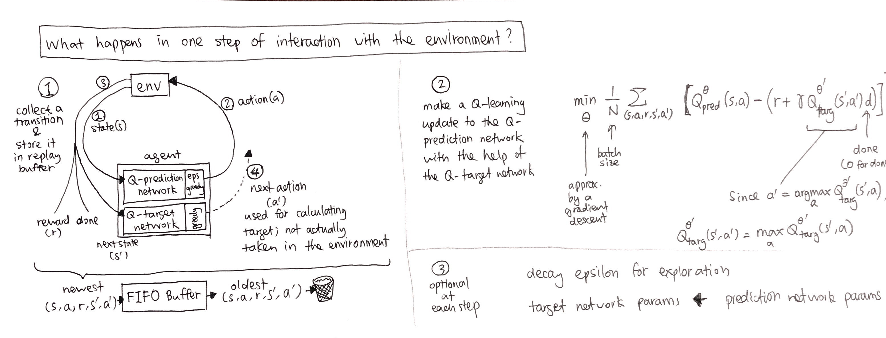

# pytorch-DQN

## What is DQN?

Note that in step 2 the square bracket should be squared.

## What is this repo?

A minimalistic implementation of DQN with

- Replay buffer
- Target network
- Epsilon-decay exploration

using

- Numpy
- PyTorch

tested on CartPole.

To start, simply run `python train_cartpole.py` in your terminal.

## How is code organized?

Dependency structure:

- train_cartpole.py (top)
    - params_pool.py
        - replay_buffer.py
    - replay_buffer.py
